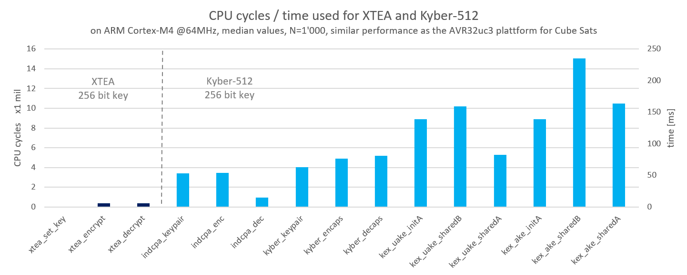
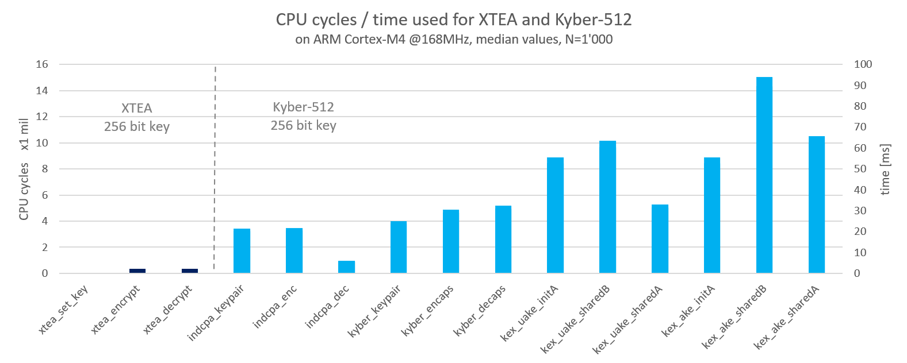

# kyber-benchmarks-STM32F4
Benchmarking the Crystals Kyber lattice based encryption algorithm on ARM Cortex-M4

### Relevance for Cube Sats

The benchmarks are relevant for the GomSpace A3200 on board computer plattform that is commonly used in small sattelites.
We were not able to perform benchmarks on the AVR32 hardware. The Cortex-M4 is a 32 bit RISC architecture similar to the AVR32.
The results can therefore be used as an estimate on how well the new PQC algorithms perform on the AVR32 plattform.
The current security standard in the libcsp project for GomSpace hardware includes simple XTEA and SHA-1 based HMAC funcitons for optional encryption.
Kyber could be used as a key exchange mechanism.

